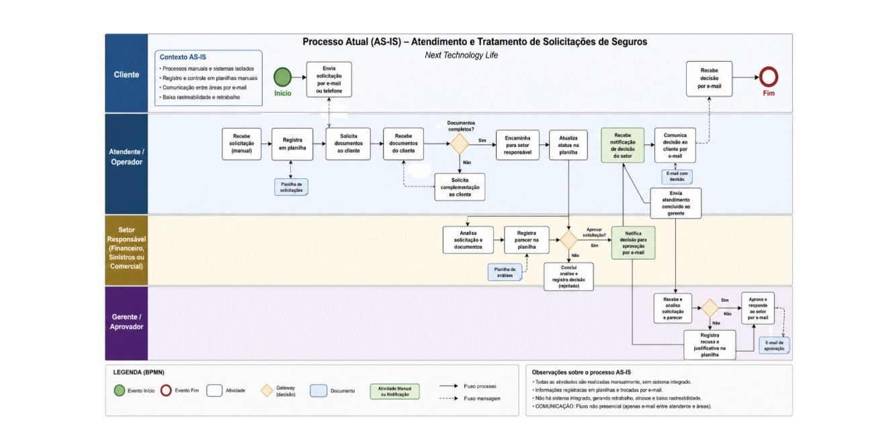

# Gestão de Processos em Seguros

## 📌 Sobre o Projeto

Projeto acadêmico desenvolvido a partir da análise dos processos de uma empresa fictícia do setor de seguros, denominada Next Technology Life.

O objetivo foi identificar problemas nos processos existentes e projetar uma solução digital integrada para centralizar informações, automatizar atividades e melhorar a gestão das solicitações.

## 🎯 Desafio

A empresa apresentava processos manuais e informações descentralizadas em planilhas, e-mails e registros, dificultando o gerenciamento de cadastros, solicitações, renovações de apólices e sinistros.

Esse cenário gerava retrabalho, atrasos, maior risco de erros, dificuldade no acompanhamento das demandas, impactos na experiência do cliente e aumento dos custos operacionais.

## 💡 Solução

Foi realizada a análise dos processos e o levantamento de requisitos para projetar uma solução digital integrada, capaz de centralizar informações e automatizar atividades importantes.

O projeto envolveu:

- Análise de processos
- Levantamento de requisitos
- Modelagem de Processos (BPMN)
- Elaboração de diagramas UML
- Desenvolvimento de protótipo navegável no Figma
- Testes de usabilidade

## 🛠️ Tecnologias e Competências

- Figma
- UML
- Modelagem de Processos (BPMN)
- Levantamento de Requisitos
- Análise de Processos
- Prototipação de Interfaces
- Testes de Usabilidade

  ## 🔄 Modelagem do Processo — BPMN

O processo atual (AS-IS) foi modelado utilizando BPMN para representar o fluxo de atendimento e tratamento das solicitações, evidenciando as atividades, os responsáveis, os pontos de decisão e os principais gargalos do processo.

## 📊 Resultados e Aprendizados

A solução proposta demonstrou potencial para integrar processos, reduzir erros, retrabalho e tempo de atendimento, além de melhorar a experiência do cliente.

O projeto proporcionou aprendizado prático em análise e modelagem de processos, levantamento de requisitos, UML, BPMN, prototipação e testes de usabilidade, fortalecendo competências de análise, resolução de problemas e aplicação da tecnologia na otimização de processos organizacionais.

## 🎓 Contexto Acadêmico

Projeto desenvolvido como atividade acadêmica na área de Tecnologia da Informação, com foco na aplicação prática de conceitos de análise de processos, requisitos, modelagem de sistemas e experiência do usuário.
